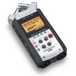

Si vous voulez enregistrer vos séances avec une qualité de son optimale, c’est le nec plus ultra. La qualité des micros est époustouflante et en plus vous pouvez enregistrer la musique et la voix sur des pistes distinctes.

254 € sur Amazon.fr : <a href="http://amzn.to/StZkvC">http://amzn.to/StZkvC</a>

349 Frs chez Dupertuis : <a rel="nofollow" href="http://bit.ly/UfA2mt">http://bit.ly/UfA2mt</a>

Le manuel : <a rel="nofollow" href="http://www.zoom.co.jp/download/F_H4n.pdf">F_H4n.pdf</a>

Le site officiel : <a rel="nofollow" href="http://www.zoom.co.jp/products/h4n">http://www.zoom.co.jp/products/h4n</a>

Une vidéo de présentation en anglais : <a href="https://www.youtube.com/watch?v=RXQDsptXHr0">https://www.youtube.com/watch?v=RXQDsptXHr0</a>

Quelques infos : <a rel="nofollow" href="http://www.samsontech.com/zoom/products/handheld-audio-recorders/h4n/">http://www.samsontech.com/zoom/products/handheld-audio-recorders/h4n/</a>

Quelques truc en anglais : <a rel="nofollow" href="http://itp.nyu.edu/help/Audio/Field">http://itp.nyu.edu/help/Audio/Field</a>

 

