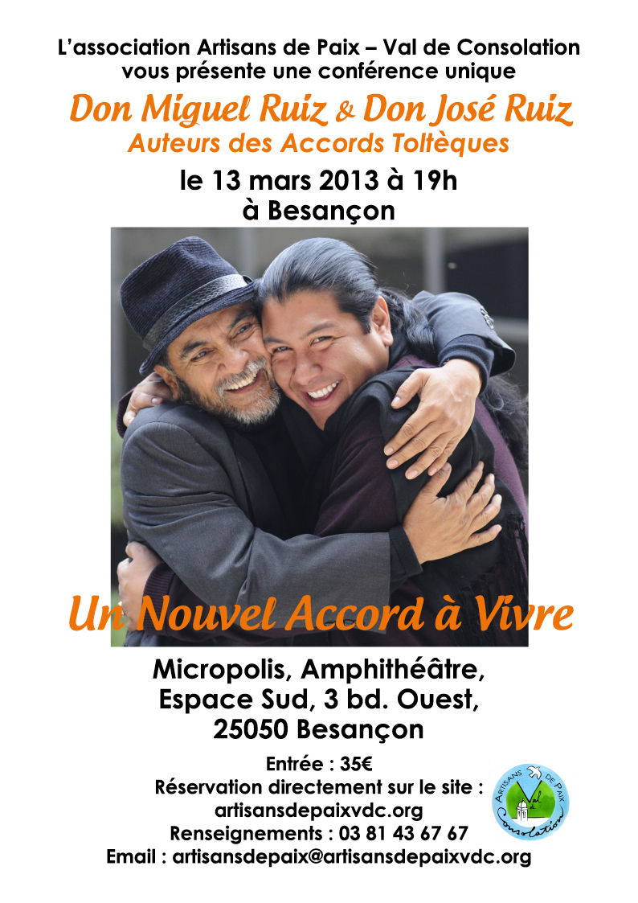

<blockquote>

<em>(voir affiche en pièce jointe)</em>

<strong>Question</strong> : sur quel livre Guillaume Canet fait-il deux gros plans dans <em>Les petits moucho</em>irs ?  <strong>Réponse</strong> : <em>Les Quatre Accords Toltèques</em>, de Miguel Ruiz. Pas étonnant : en 14 ans, ce code de conduite pour vivre une vie meilleure a déjà conquis 7 millions de personnes dans près de 40 pays. Aujourd’hui, ces fameux accords sont même appliqués dans l’entreprise, aux États-Unis comme en France.

<strong>Question</strong> : après 13 mois de tournée mondiale d’enseignement, quel pays a choisi Miguel Ruiz pour y établir sa base mondiale ?  <strong>Réponse</strong> : la France ! C’est en effet au Val de Consolation (25), où Alain Michel dirige l’association Artisans de Paix, que Don Miguel et son fils Don José comptent animer des formations intensives pour transmettre leurs enseignements à des participants de tous pays.

<strong>Question</strong> : pourquoi avoir choisi le Val de Consolation ?  <strong>Réponses</strong> : Parce que la vocation d’école de la paix de ce lieu rejoint les aspirations des Ruiz. Parce que le cadre naturel exceptionnel du Val se prête idéalement à des formations résidentielles approfondies. Parce qu’étant une association à but non lucratif, Artisans de Paix peut proposer ces enseignements (ainsi que d’autres) aux conditions les plus justes. Après avoir fait salle comble à Vevey (Suisse), à Paris et à Nantes en octobre 2012, lors de leur toute première venue en Europe, c’est donc à Besançon, à une heure du Val de Consolation, que Don Miguel Ruiz viendra donner une nouvelle conférence en mars prochain, avant de revenir enseigner à Consolation même en juin.

 

L’association Artisans de Paix - Val de Consolation vous présente

une conférence unique de <strong>DON MIGUEL RUIZ & DON JOSE RUIZ</strong>

<strong>Un Nouvel Accord à Vivre</strong>

Micropolis, Amphithéâtre, Espace Sud

3 bd. Ouest, 25050 Besançon

le 13 mars 2013 à 20h30

Réservation directement sur le site : <a href="http://artisansdepaixvdc.blogspot.fr/">artisansdepaixvdc.blogspot.fr</a>

<strong>Renseignements</strong> : Téléphone : 03 81 43 67 67

<strong>Mail</strong> : <a href="mailto:artisansdepaix@artisansdepaixvdc.org">artisansdepaix@artisansdepaixvdc.org</a>

</blockquote>

 

