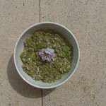

- 3 poignées de feuilles d’ortie
- De l’huile (selon votre goût)
- Le jus d’un citron
- 1 oignon…

Mixer le tout puis :

- 1 bonne poignée de fleurs de cardamine

Mélanger au pesto

- S’en délecter, sur des chapatis, galettes de riz, toast…… !!!

