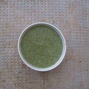

- 50 % de berce
- 50 % d’égopode

Faire bouillir dans un peu d’eau 15 minutes

- Une échalote
- De la crème
- Sel, poivre
- … pas trop d’épices, car le goût de la berce et de l’égopode au naturel est déjà magique ;-) !

Mixer et c’est fini ! Et c’est tellement bon !

