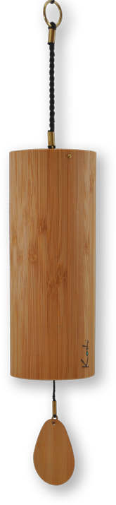

J’ai testé pour vous lors d’une méditation sous Terre : ces carillons sont absolument magiques !

<a href="http://koshi.fr">koshi.fr</a>

Pour les acheter : [boutique-bien-etre.com](https://boutique-bien-etre.com/melodies/1-2-carillon-koshi.html#/2-melodie-aqua)

<!--

Pour les acheter : <a href="http://www.boullard.ch">www.boullard.ch</a>

-->

J’ai craqué pour un carillon <em>Aqua</em> à 59 Frs.

