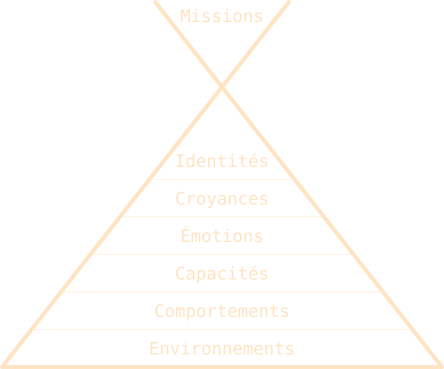

> Aucun problème ne peut être résolu sans changer le niveau de conscience qui l’a engendré.  *\[ Albert Einstein \]*

## Histoire vraie

[Au XVe Sommet de la francophonie à Dakar en 2014](http://www.francophoniedakar2014.sn), quelqu’un posa la question suivante à [Didier Burkhalter](https://en.wikipedia.org/wiki/Didier_Burkhalter), alors président de la Suisse :

— Un enfant qui a perdu ses parents est un orphelin. Un homme qui a perdu sa femme est un veuf. Une femme qui a perdu son mari est une veuve. Mais comment appelle-t-on un parent qui a perdu son enfant ?

Ce à quoi il répondit :

— C’est vrai que la langue française n’a pas de mot pour exprimer celà. Mais au delà des mots, la perte d’un enfant c’est avant tout une grande souffrance.

Voilà un exemple parfait d’application de la pyramide de Dilts : si on teste vos capacités, répondez par l’émotion…
