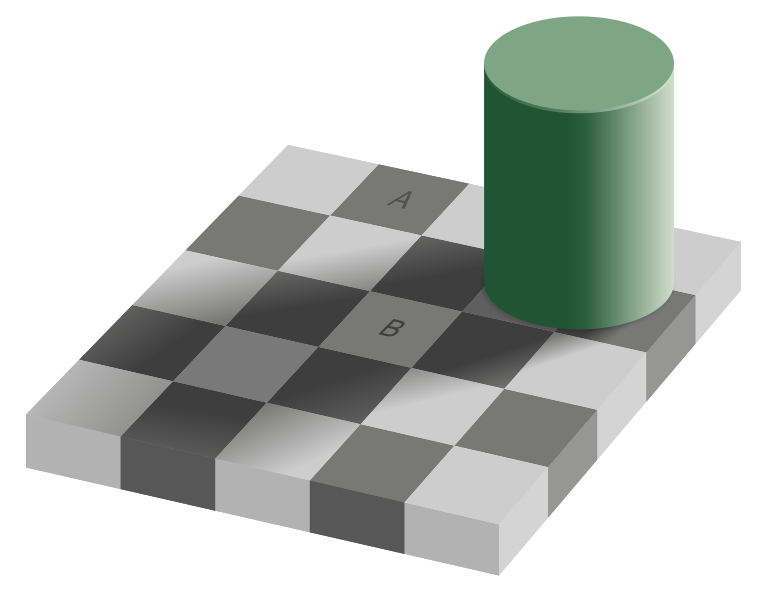
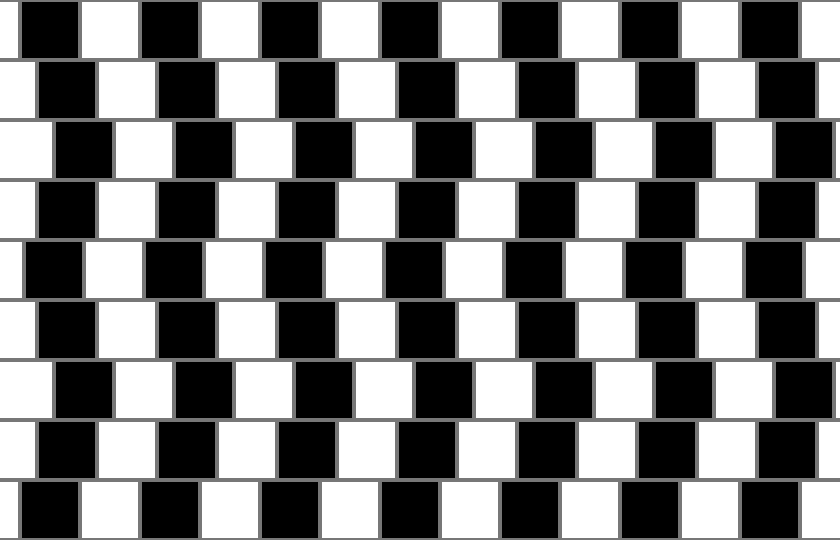
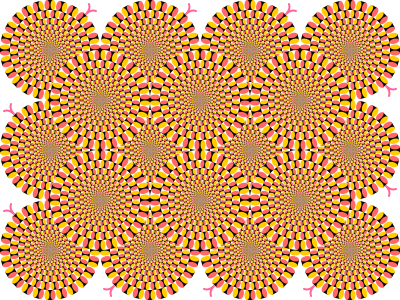



    ## STYLES

    -   Cet article utilise sa propre feuille de style CSS `style.css` qui surcharge les styles CSS par défaut.



## Illuzion

Quelle figure a la plus grande aire, la rouge ou l’orange ?
 Cliquez sur l’image pour voir un indice.

<!--
Le SVG doit être injecté directement dans le HTML pour que ses scripts soient activés.
 -->


## L’échiquier d’Adelson

<https://commons.wikimedia.org/wiki/File:Optical_illusion_greysquares.gif?uselang=fr>

<https://fr.wikipedia.org/wiki/%C3%89chiquier_d'Adelson>

<https://www.youtube.com/watch?v=z9Sen1HTu5o>

## La danseuse tournante

<object data="./images/danseuse-tournante.gif"></object>

## Illusion du mur du café

<small>Par Fibonacci — Travail personnel, CC BY-SA 3.0, https://commons.wikimedia.org/w/index.php?curid=1788689</small>

<https://fr.wikipedia.org/wiki/Illusion_du_mur_du_caf%C3%A9>

## Les serpents tournants d’Akiyoshi Kitaoka

## La fenêtre de Ames

<https://en.wikipedia.org/wiki/Ames_window>

<https://www.youtube.com/watch?v=dBap_Lp-0oc>

<https://en.wikipedia.org/wiki/Ames_room>

# Voir aussi

<https://fr.wikipedia.org/wiki/Illusion>

<https://fr.wikipedia.org/wiki/Illusion_d%27optique>
