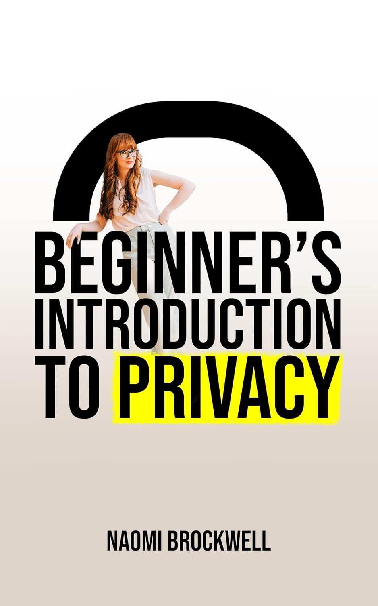

> Ce texte est une traduction du chapitre d’introduction du livre “[Beginner’s Introduction To Privacy](https://www.amazon.fr/dp/B0BQHS8MFS/)” de Naomi Brockwell disponible en échantillon sur [sa page Amazon](https://www.amazon.fr/dp/B0BQHS8MFS/).
> Le livre a été publié le 18 décembre 2022 et restera probablement d’actualité encore longtemps.
> Il n’y a pas de traduction officielle à ce jour (juin 2026).

## Introduction à la vie privée à l’ère numérique

Ce livre est une introduction à la vie privée à l’ère numérique. Pour comprendre pourquoi c’est un sujet important, il suffit de regarder ce qui se passe dans l’actualité.

Après l’invasion de l’Ukraine par la Russie, le nombre d’utilisateurs de Tor et de Signal a explosé, parce que les citoyens ont soudainement compris qu’il était essentiel de protéger leur vie privée dans une situation hostile.

En Iran, il y a eu des manifestations massives contre l’autoritarisme. En réponse, le parlement a voté à une écrasante majorité l’exécution des 15 000 manifestants qu’il avait arrêtés. Ces exécutions ont déjà commencé[^1]. Les manifestants sont de plus en plus conscients de l’importance de protéger leur vie privée lorsqu’ils expriment leur opposition au gouvernement.

Dans le monde entier, des personnes se retrouvent régulièrement propulsées sous les projecteurs du jour au lendemain lorsqu’une chose qu’elles ont dite devient soudainement virale. Elles n’avaient pas réalisé que leur adresse personnelle était partout sur Internet, et maintenant la sécurité de leur famille est menacée.

Ce sont de grands exemples qui peuvent nous montrer les conséquences d’un monde étroitement connecté où la vie privée passe après tout le reste.

Nous ne devrions pas attendre que la situation soit grave pour apprendre à utiliser les outils de confidentialité. Ce sont des choses que nous devrions tous connaître dès maintenant. Non seulement apprendre de nouveaux outils en temps de crise est une très mauvaise idée, mais il pourrait aussi être trop tard à ce moment-là.

Mais la vie privée ne consiste pas seulement à se protéger contre un événement improbable mais catastrophique dans le futur. Il s’agit de nous protéger contre des menaces bien réelles et constantes dans le présent. Ces menaces peuvent être difficiles à voir, parce qu’Internet est une idée très abstraite pour beaucoup de gens. J’espère que ce livre apportera un éclairage sur la raison pour laquelle la vie privée est plus importante qu’on ne le réalise.

### La vie privée est un processus itératif

La vie privée n’est pas absolue. Et ce n’est pas non plus un objectif final. C’est un processus en constante évolution. La plupart des gens n’ont pas envie d’entendre cela. Ils aiment les solutions miracles. Ils veulent prendre une pilule, ou acheter un produit, et leur problème sera réglé. Ce n’est tout simplement pas ainsi que fonctionne la vie privée.

Disons que vous “corrigez” un domaine de fuite de données dans votre vie. Si quelqu’un veut vraiment vous cibler et obtenir vos données, il fera des itérations et trouvera de nouvelles façons d’y parvenir. La vie privée devient alors une sorte de jeu de taupe, et c’est pour cela que les gens la trouvent si difficile. Ils cherchent une solution étanche et complète.

La question est de savoir si quelqu’un veut réellement vous cibler. Pour la plupart d’entre nous, la réponse est non. Cela signifie que nous pouvons déjà aller très loin en apportant de simples changements dans nos vies, et cela aura un impact énorme sur notre vie privée. Plus vous êtes “à risque”, plus vous devez être prudent et plus vous devez ajouter de couches de protection. Déterminer votre profil de risque est quelque chose que vous seul pouvez faire. Vous devrez examiner de quoi vous voulez vous protéger, et quelle part de confort vous êtes prêt à sacrifier pour cette protection.

Il est important de se poser la question suivante : quel type de surveillance m’inquiète ? Suis-je une cible spécifique ? Est-ce que je veux seulement éviter la surveillance commerciale générale ? Est-ce que je cherche à gagner le plus de liberté possible dans ma vie ? Cela s’appelle analyser votre modèle de menace, et cela reviendra souvent dans ce livre, car nous proposerons différentes options selon les personnes, avec des compromis différents entre sécurité et confort, en fonction de votre modèle de menace.

Alors, où vous situez-vous sur ce spectre entre vie privée et confort ?

### La vie privée comme spectre

À une extrémité du spectre se trouvent les personnes dont la maison est remplie d’objets connectés comme des thermomètres intelligents, des systèmes de sécurité, une Alexa, qui utilisent les SMS et Gmail pour tout, et qui ont un téléphone rempli d’innombrables applications qu’elles emportent partout avec elles. Ça vous parle ?

À l’autre extrémité se trouvent les personnes qui vous disent que la seule façon de protéger votre vie privée est de jeter tous vos appareils numériques et de vivre dans une forêt, à l’intérieur d’une cage de Faraday, coupé du monde extérieur. Ne pas utiliser Internet est certes une façon de retrouver sa vie privée numérique. Mais où est le plaisir là-dedans ?

Il existe un juste milieu pour la personne moyenne. Aucun de nous ne veut jeter son ordinateur et son téléphone. Internet est formidable et nous devrions pouvoir participer à ce monde merveilleusement interconnecté sans avoir l’impression de sacrifier toute notre vie privée en le faisant. Même dans ce juste milieu, il existe différents niveaux de confidentialité vers lesquels tendre, ce qui dépend encore une fois de votre modèle de menace et de votre volonté de sacrifier du confort pour la vie privée.

Êtes-vous ciblé par quelqu’un ? Vous aurez besoin de mesures de confidentialité extrêmes. Nous donnons quelques pistes sur l’endroit où trouver ces conseils dans un instant. Il faut savoir que la confidentialité extrême est très difficile, et qu’elle exige de sacrifier d’importants conforts dans votre vie. La plupart des personnes qui visent cela savent vraiment ce qu’elles font, ou bien s’épuisent assez vite.

Si vous commencez tout juste votre parcours vers la vie privée, vous devez savoir que la fatigue liée à la confidentialité est une réalité bien concrète. Je vous conseille de faire un petit changement à la fois, et de ne pas vous laisser submerger par tout ce qu’il y a à couvrir. Ce livre se concentre sur les changements les plus simples que vous pouvez faire et qui ont le plus grand impact sur votre vie. Même si vous ne faites que quelques-uns de ces changements, vous réduisez quand même votre empreinte numérique et vous devriez être fier de vos efforts, car tout cela fait une différence.

### Les fissures dans le système

Snowden a dit un jour :

> « C’est, d’une certaine manière sombre, psychologiquement rassurant de dire : “Oh, tout est surveillé et je ne peux rien faire. Je ne devrais même pas m’en soucier.” Le problème, c’est que ce n’est pas vrai. »[^2]

Nous considérons souvent la surveillance comme un système unique et monolithique auquel nous ne pouvons pas échapper. En réalité, elle résulte d’innombrables systèmes différents. Non seulement il existe des fissures entre ces systèmes, mais ces fissures peuvent être apprises par des personnes soucieuses de leur vie privée. Dans ce livre, notre objectif est de vous enseigner certains des leviers les plus efficaces que vous pouvez actionner pour commencer votre parcours vers la vie privée.

Il est important de comprendre que chaque couche de protection que vous ajoutez n’est pas infaillible, mais nous allons vous montrer comment superposer les solutions afin de vous donner les meilleures chances possibles de préserver votre vie privée à l’ère numérique.

### Comprendre la technologie que nous utilisons

La plupart d’entre nous ne comprennent pas du tout la technologie que nous utilisons.

Pourquoi le ferions-nous ? Nous ne sommes pas tous développeurs logiciels ou ingénieurs réseau.

L’avantage d’utiliser la technologie moderne, c’est que nous n’avons pas besoin de la comprendre pour nous en servir. Je n’ai pas besoin de savoir comment mon ordinateur fonctionne pour pouvoir appuyer sur le bouton d’alimentation et consulter mes e-mails.

En tant que société, nous avons levé les barrières à l’entrée et rendu une technologie qui change la vie accessible à tout le monde.

Mais il y a un danger à utiliser des choses que nous ne comprenons pas. Nous faisons des compromis dont nous n’avons même pas conscience.

Ce n’est pas un livre d’informatique. Nous n’allons pas plonger dans les complexités pointues du fonctionnement des ordinateurs. Mais nous allons vous donner assez d’informations pour que vous puissiez prendre des décisions plus éclairées dans votre vie.

Ce livre n’a pas pour but de vous persuader d’arrêter d’utiliser certains produits et services. Il sert à vous faire prendre conscience de la manière dont ces produits et services pourraient vous nuire, afin que vous puissiez prendre vous-même la décision de ce qui est le mieux pour votre vie. De cette façon, nous pouvons devenir des êtres humains plus autonomes.

### Ressources supplémentaires

J’ai beaucoup lu et beaucoup recherché au fil des années, et cela a façonné ma vision de la vie privée. Voici quelques éléments qui m’ont inspirée dans mon parcours, et que vous devriez explorer si vous voulez en apprendre davantage sur la protection de votre vie privée en ligne :

#### Livres

*Extreme Privacy* - Michael Bazzel

Ce livre est une lecture monumentale. Il est dense sur le plan technique, très approfondi, et constamment mis à jour avec les recherches et les outils les plus récents. Si vous décidez d’aller plus loin dans le terrier de la vie privée, c’est un livre incontournable. Il s’adresse aux personnes prêtes à faire un effort supplémentaire pour se protéger en ligne. Même si vous n’êtes pas encore prêt à mettre en œuvre certaines des suggestions proposées, il est très instructif sur la manière dont vos données sont collectées et sur ce que vous pouvez faire pour l’empêcher, et il vaut absolument la peine d’être lu.

*Permanent Record* - Edward Snowden

Un excellent aperçu de l’évolution du paysage d’Internet au cours des 20 dernières années. Nous sommes passés d’êtres transitoires, libres de changer et d’évoluer, à des archives permanentes retraçant chacun de nos actes et de nos pensées. Snowden offre une argumentation d’une grande éloquence sur les raisons pour lesquelles nous devrions tous commencer à protéger notre vie privée, et explique pourquoi il a bouleversé sa vie pour défendre cette cause.

*No Place to Hide: Edward Snowden, the NSA, and the U.S. Surveillance State* - Glenn Greenwald

Le point de vue d’un journaliste sur l’importance de la liberté d’expression, et sur le rôle crucial que joue la vie privée à cet égard. Il se penche sur les révélations Snowden, dont il a fait partie des équipes récompensées par le prix Pulitzer qui les ont d’abord présentées au monde. Le récit qu’il en donne est fascinant, et il dresse un tableau glaçant de ce à quoi nous pourrions aboutir si nous perdions notre vie privée dans notre quotidien.

#### Podcasts

*Darknet Diaries*[^3]

Un podcast à la fois instructif et terrifiant, rempli d’histoires vraies issues du côté obscur d’Internet. Si vous voulez comprendre les menaces qui existent pour les gens ordinaires, écoutez ce podcast. Ce sont des histoires fascinantes où chaque épisode se lit comme un thriller, et vous apprendrez énormément.

*The Privacy, Security, and OSINT Show*[^4]

Animé par Michael Bazzel, c’est un excellent complément à son livre *Extreme Privacy*. La technologie évolue sans cesse, alors n’hésitez pas à écouter ce podcast pour suivre les mises à jour régulières sur l’ensemble de ses méthodes de confidentialité extrême.

#### Sites web

*Freedom of the Press Foundation*[^5]

Ils proposent d’excellentes ressources destinées à aider des personnes comme les journalistes à protéger leur vie privée. Ce sont de très bonnes informations qui nous concernent tous.

*The Electronic Frontier Foundation (EFF)*[^6]

Ils proposent d’excellents guides et outils en ligne, ainsi que des explications pour vous aider à protéger votre vie privée en ligne.

### Votre parcours personnel de confidentialité

Enfin, il existe toutes sortes de raisons pour lesquelles vous êtes peut-être en train de lire ce livre. Chacun a un parcours différent en matière de vie privée, chacun se trouve à un stade différent, chacun a des circonstances de vie différentes qui l’ont amené ici.

Ce livre est pour tout le monde.

Peut-être voulez-vous mieux protéger votre jeune fille d’un monde hostile dans lequel elle ne comprend pas encore les conséquences de ses actions numériques.

Peut-être n’aimez-vous pas que les entreprises partagent vos données avec des milliers d’autres sociétés et tirent énormément d’argent de vos informations personnelles et sensibles.

Peut-être êtes-vous préoccupé par la surveillance de masse exercée par les gouvernements, car même si vous faites confiance à votre gouvernement aujourd’hui, ce ne sera peut-être pas le cas demain. Les régimes passent, mais ces données restent pour toujours.

Peut-être voyagez-vous dans un pays où vous craignez qu’ils ne soient pas amicaux envers quelqu’un dans votre situation.

Peut-être souhaitez-vous pouvoir communiquer en privé avec vos proches.

Peut-être voulez-vous devenir une personne plus autonome, qui fait des choix plus éclairés, et vous souhaitez que votre technologie travaille pour vous plutôt que l’inverse.

Quoi qu’il vous ait amené à commencer votre parcours vers la vie privée : bienvenue.

La vie privée est normale, et c’est un idéal qui mérite qu’on se batte pour lui.

La surveillance n’est pas inévitable. Arrêtons de la normaliser, et reprenons nos vies.

### Note importante

Bien que toutes les informations de ce livre étaient exactes au moment de la publication, la technologie évolue rapidement. Nous prévoyons de publier de nouvelles éditions de ce livre qui n’incluront pas seulement les mises à jour pertinentes, mais aussi des chapitres supplémentaires pour que vous puissiez continuer à développer votre parcours de confidentialité.

Vous pouvez aussi garder un œil sur notre chaîne[^7] pour obtenir les informations les plus récentes.

Il s’agit d’un guide pour débutants sur la vie privée, et il est parfait pour toute personne qui ne sait pas par où commencer. Une fois que vous aurez acquis de bonnes bases sur les sujets que nous avons abordés et que vous voudrez aller vers des techniques de confidentialité plus complexes et sophistiquées, nous vous recommandons vivement d’essayer certaines des autres ressources que nous avons suggérées ci-dessus.

[^1]: [https://www.amnesty.org/en/latest/news/2022/12/iran-horrifying-execution-of-young-protester-exposes-authorities-cruelty-and-risk-of-further-bloodshed/](https://www.amnesty.org/en/latest/news/2022/12/iran-horrifying-execution-of-young-protester-exposes-authorities-cruelty-and-risk-of-further-bloodshed/)

[^2]: [https://twitter.com/Snowden/status/1546790812704440322](https://twitter.com/Snowden/status/1546790812704440322)

[^3]: [https://darknetdiaries.com/](https://darknetdiaries.com/)

[^4]: [https://inteltechniques.com/podcast.html](https://inteltechniques.com/podcast.html)

[^5]: [https://freedom.press/](https://freedom.press/)

[^6]: [https://www.eff.org/](https://www.eff.org/)

[^7]: [https://www.nbtv.media/](https://www.nbtv.media/)
