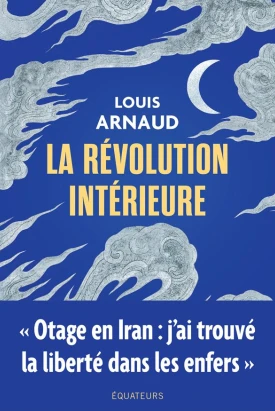
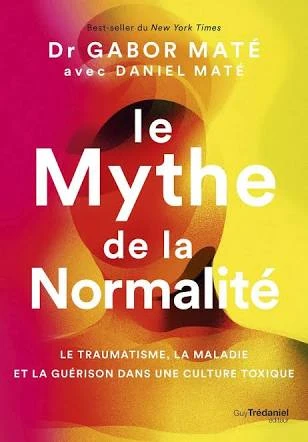
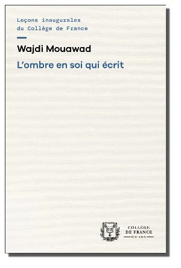
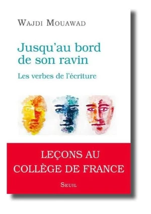

Trois livres remarquables, par Olivier Clerc

1.  **_“La révolution intérieure”_**,
     Louis Arnaud
    -   https://www.blog.olivierclerc.com/blog/trois-livres-remarquables-a-decouvrir-la-revolution-interieure-1-3
    -   https://www.youtube.com/watch?v=C659WO898A8

2.  **_“Le Mythe de la Normalité”_**,
     Dr Gabor Maté
    -   https://www.blog.olivierclerc.com/blog/trois-livres-remarquables-le-mythe-de-la-normalite-2-3

3.  **_“L’ombre en soi qui écrit”_**
     & **_“Jusqu’au bord de son ravin”_**,
     Wajdi Mouawad
    -   https://www.blog.olivierclerc.com/blog/trois-livres-remarquables-wajdi-mouawad-3-3
    -   https://www.youtube.com/playlist?list=PLHFU8yWQ83n4MNOrfXxPk-s9w4mGfw-I6

