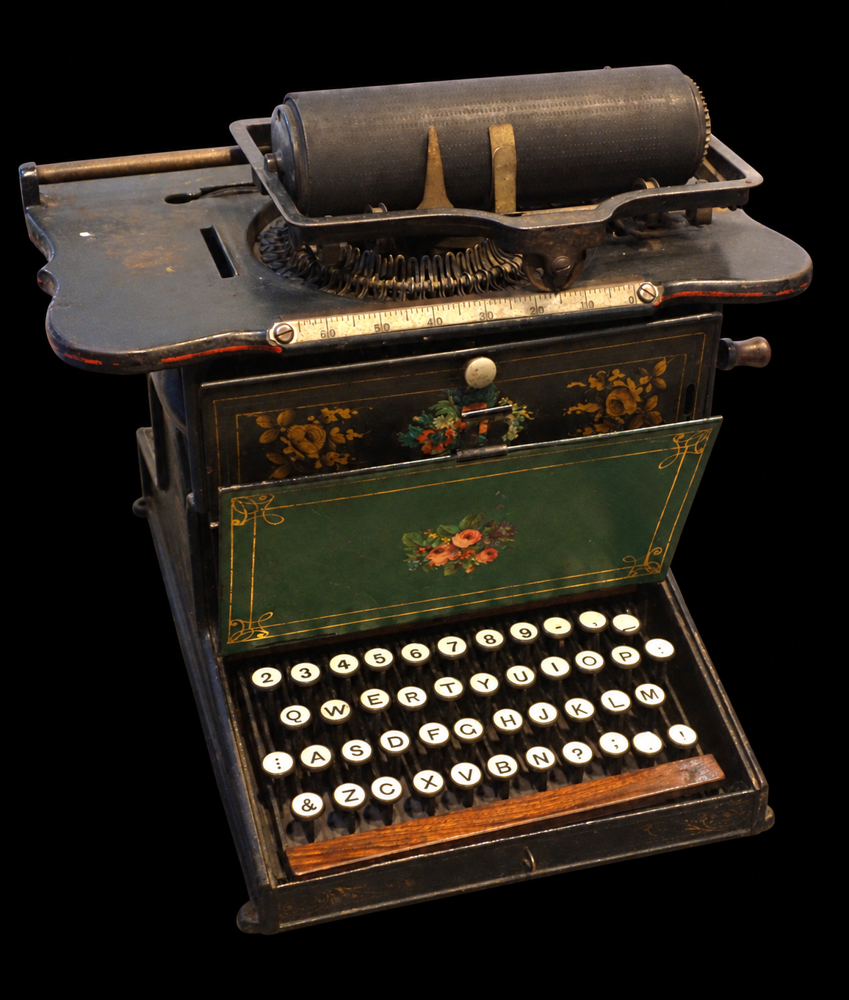

> Une légende urbaine tenace voudrait que la disposition des touches de nos claviers ait été délibérément choisie pour ralentir la frappe.
> L’explication avancée est la suivante :
>
> _Sur les machines à écrire mécaniques, les barres à caractères avaient la fâcheuse tendance à s’enchevêtrer et ainsi provoquer des bourrages._
> _Pour éviter cela, on aurait choisi une disposition des touches censée ralentir la frappe : QWERTY._

_Remington nº 1 (Sholes & Glidden), Wisconsin Historical Museum. 
Photo originale : Daderot, 2013 — CC0._[^5]
_Image retouchée par IA pour remplacer le fond._

## Inspiration de ce billet de blog

Cette légende urbaine est véhiculée dans des dizaines de vidéos YouTube.
Celle de Schach[^1] a fini par me donner envie d’écrire ce billet.
J’aime bien ses _shorts_, donc je ne lui tiens pas trop rigueur de ce raccourci sur un sujet qui, pourtant, nous fait royalement ch... tous les jours.

_YouTube — Schach — Le clavier AZERTY : un anti-design conçu pour vous ralentir_[^1]

## Petites notes au passage

> Ce billet parle de la disposition QWERTY.
>
> QWERTY tire son nom des six premières touches alphabétiques du clavier conçu par et pour des anglophones.
>
> Ses variantes dérivées pour la langue allemande et la langue française, respectivement QWERTZ et AZERTY, ont hérité en grande partie de la loufoquerie de leur ancêtre, mais pas de toutes ses caractéristiques comme la disposition des touches Z, S et E dont il est question dans ce billet.
>
> Des dispositions de touches comme Bépo, Colemak, Dvorak ou Workman ont été conçues pour pallier certaines limites ergonomiques de QWERTY, mais ce n’est pas le sujet ici.

## Quelques faits

J’ai discuté de cet épineux problème avec ChatGPT dans cet _échange sur l’origine des claviers occidentaux_[^2].
Il m’a orienté vers deux références :

-   _ZINBUN — Koichi Yasuoka and Motoko Yasuoka — On the Prehistory of QWERTY, no 42 (2009/2010), p. 161–174_[^3]
-   _The Truth of QWERTY — Koichi Yasuoka — Billet du 3 avril 2016_[^4]

Voici ce que je retiens de l’article des Yasuoka :

-   **Les sources citées ne permettent pas d’établir que QWERTY a été conçu pour ralentir la frappe.**
    Les auteurs contestent explicitement cette explication.
-   **L’évolution du clavier est documentée, mais les raisons de chaque déplacement de touche ne sont pas toutes établies.**
    QWERTY résulte de remaniements successifs et de compromis entre plusieurs acteurs, plutôt que d’un plan unique.
-   **La télégraphie a joué un rôle dans cette histoire.**
    Parmi les premiers·ères dactylographes figuraient des télégraphistes qui transcrivaient les messages reçus en Morse.

Les auteurs proposent notamment une explication pour le voisinage de Z, S et E : dans le code Morse états-unien, la lettre “Z” pouvait être confondue avec la séquence de lettres “SE”.
Seul le contexte pouvait lever l’ambigüité.
Rapprocher les touches permet d’optimiser la vitesse de transcription une fois le doute résolu.
**Il s’agit d’une hypothèse sur ce placement**, qui ne démontre ni une méthode consistant à préparer trois doigts sur ces touches ni une optimisation de tout le clavier pour le Morse.

Dans son billet de 2016, Koichi Yasuoka relève aussi que les barres des lettres “E” et “R” étaient voisines, alors que “ER” est une combinaison fréquente en anglais.
Ce contre-exemple fragilise le récit selon lequel on aurait systématiquement éloigné les barres correspondant aux paires de lettres les plus courantes pour éviter les bourrages.

Éviter des bourrages et chercher à ralentir la frappe sont deux intentions différentes.
La seconde mérite des preuves.
Et pour la réfuter, mieux vaut garder les incertitudes de cette histoire que remplacer une légende séduisante par une autre certitude trop commode.

## Quelques pistes en vrac

-   Il suffit de taper au clavier d’une machine mécanique pour se rendre compte que les bourrages sont fréquents quand on est novice.
    Donc, soit le design QWERTY est un échec, soit il n’a jamais eu pour but de ralentir la frappe.
-   Remington aurait privilégié une commercialisation rapide de la Remington nº 1, au point de reléguer la disposition des touches au second plan.
-   Au 19e siècle, le nombre de modèles de machines à écrire était important.
    Les inventeurs reprenaient simplement la disposition existante des touches avec relativement peu de modifications pour des raisons pratiques, principalement pour éviter de réinventer la roue.
-   Christopher Latham Sholes n’est pas l’inventeur de la machine à écrire elle-même, il a juste modernisé la mécanique.
    Et son design a été rendu célèbre sous le nom de Remington nº 1.

## Fun facts

-   Une autre légende voudrait que la disposition QWERTY ait été retenue parce qu’elle permet d’écrire le mot “TYPEWRITER” en n’utilisant que les touches de la rangée du haut.

## Autres loufoqueries de nos claviers

-   Les touches des machines à écrire sont disposées en quinconce pour simplifier la mécanique des tringles qui activent les barres.
    Cette disposition perdure sur les claviers d’ordinateur, alors que la contrainte mécanique n’existe plus et qu’une disposition orthogonale serait plus ergonomique.

## Quelques infos diverses

### QWERTZ et la Suisse

La langue allemande utilise beaucoup plus le Z et beaucoup moins le Y que l’anglais (voir les fréquences ci-dessous).
Du coup, le clavier QWERTZ allemand intervertit le Z et le Y pour que le Z puisse être frappé indifféremment de la main droite ou de la main gauche.

La Suisse, avec sa majorité germanophone, a logiquement choisi la disposition QWERTZ, mais les caractères accentués y sont habilement répartis pour satisfaire les francophones (et peut-être les italophones, mais il faudrait que je me renseigne).
Le clavier est physiquement le même pour toute la Suisse, mais l’attribution des caractères accentués est inversée selon la région linguistique.
Cependant, même si les Suisses·ses utilisent tous·tes le même clavier, leur pilote (_driver_) est différent, ce qui permet de taper les caractères accentués les plus fréquents dans chaque langue sans utiliser la touche _shift_.

Par exemple, si un·e Romand·e appuie sur la touche é/ö, celle-ci inscrit le caractère é (sans shift) et ö (avec shift), alors que pour un·e Alémanique c’est l’inverse.

### Fréquences des lettres par langue selon le Scrabble

| Points |       🇬🇧 Anglais       |     🇩🇪 Allemand      |      🇫🇷 Français       | 🇮🇹 Italien |
| :----: | :--------------------: | :------------------: | :--------------------: | :--------: |
| **1**  | A E I L N O R S T U | A D E I N R S T U | A E I L N O R S T U |  A E I O   |
| **2**  |          D G           |       G H L O        |         D G M          |  C R S T   |
| **3**  |        B C M P         |       B M W Z        |         B C P          |  L M N U   |
| **4**  |       F H V W Y        |       C F K P        |         F H V          |     —      |
| **5**  |           K            |          —           |           —            | B D F P V  |
| **6**  |           —            |       Ä J Ü V        |           —            |     —      |
| **8**  |          J X           |         Ö X          |          J Q           |   G H Z    |
| **10** |          Q Z           |         Q Y          |       K W X Y Z        |     Q      |

[^1]: [YouTube — Schach — Le clavier AZERTY : un anti-design conçu pour vous ralentir](https://www.youtube.com/watch?v=ETLZHomEPF8)

[^2]: [ChatGPT — Origine des claviers occidentaux](https://chatgpt.com/share/6aa6774f-68f8-83eb-860c-a54be8a209e5)

[^3]: [ZINBUN — Koichi Yasuoka and Motoko Yasuoka — On the Prehistory of QWERTY](https://repository.kulib.kyoto-u.ac.jp/server/api/core/bitstreams/dc434be9-80cd-499b-a984-f9fa35954c3b/content) — [Copie locale du PDF](docs/42_161.pdf).

[^4]: [The Truth of QWERTY — Koichi Yasuoka — Billet du 3 avril 2016](https://yasuoka.blogspot.com/2016/04/the-qwerty-arrangement-was-created-in.html)

[^5]: [Wikimedia Commons — Daderot — Remington nº 1, Wisconsin Historical Museum](https://commons.wikimedia.org/wiki/File:Remington_No._1_typewriter,_made_by_Remington_&_Songs,_Ilion,_NY,_1873-1878,_the_first_Sholes_&_Glidden_model_typewriter_made_by_Remington_-_Wisconsin_Historical_Museum_-_DSC02806.JPG) — [CC0 1.0](https://creativecommons.org/publicdomain/zero/1.0/deed.fr).
